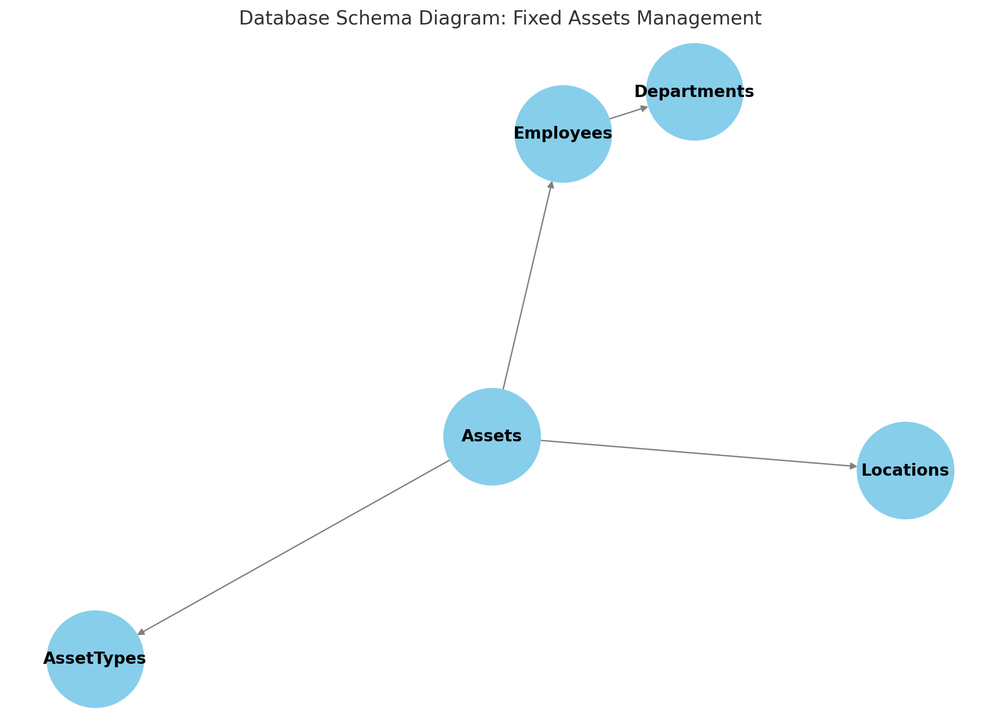

# Fixed-Assets-Database
A database for managing fixed assets in a company, including assets, employees, departments, locations, and asset types. It ensures efficient tracking and management with clear relationships between data entities.

# Fixed Assets Management
This project is a database for managing fixed assets within a company. The database includes tables for assets, employees, departments, locations, and asset types.

* Database Structure
* Assets: Contains information about the fixed assets.
* Employees: Contains information about the employees.
* Departments: Contains the company's departments.
* Locations: Contains the physical locations of the assets.
* AssetTypes: Contains types of fixed assets.

# How to Run the Project
* Create the database by running create_database.sql.
* Populate the tables with test data by running insert_data.sql.
* Explore the queries in queries.sql.

Database Diagram: 

